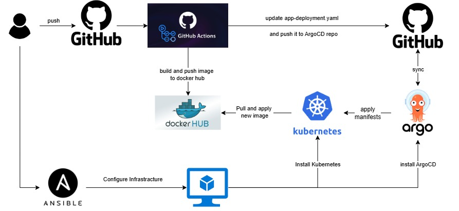
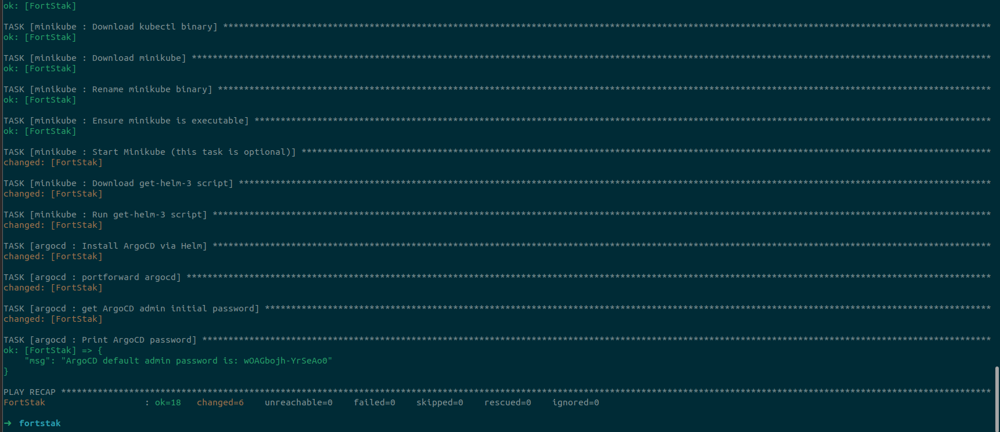
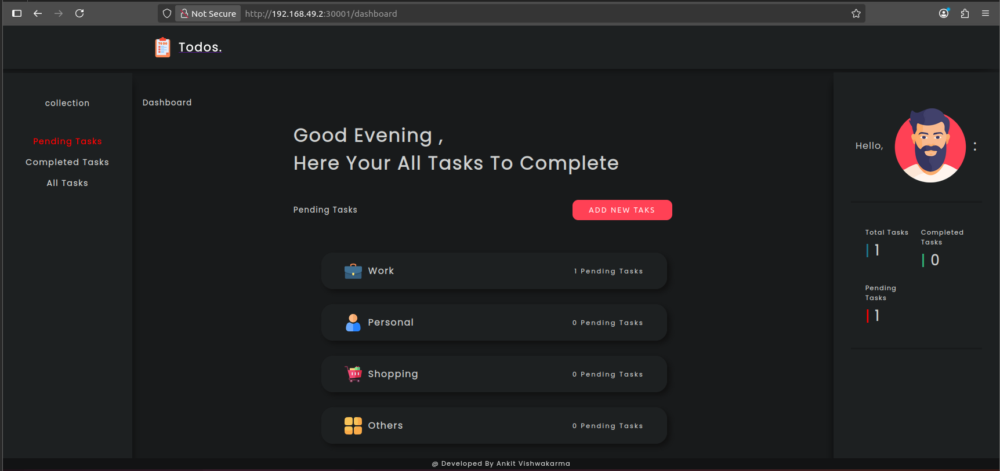
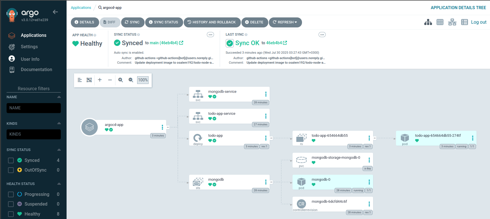

# FortStak DevOps Internship Assessment

## 📋 Project Overview

This comprehensive DevOps project demonstrates a complete CI/CD pipeline implementation using modern DevOps tools and practices. The project includes a full-stack Todo List application deployed on Kubernetes with automated infrastructure provisioning, containerization, and GitOps practices.

## 🏗️ Architecture Overview



#### The `app-deployment.yaml` is pushed to [ArgoCD GitHub Repo](https://github.com/osalem192/FortStak_ArgoCD.git) and then `ArgoCD` Sync to it.


## 📁 Project Structure

```
FortStak Internship Assessment/
├── Ansible/                          # Infrastructure automation
│   ├── ansible.cfg                   # Ansible configuration
│   ├── inventory                     # Target hosts configuration
│   ├── playbook.yaml                 # Main automation playbook
│   └── roles/                        # Modular Ansible roles
│       ├── docker/                   # Docker installation role
│       ├── minikube/                 # Minikube & kubectl setup
│       └── argocd/                   # ArgoCD installation role
│
├── Code_and_Dockerfile/              # Application source code
│   ├── Dockerfile                    # Container definition
│   ├── assets/                       # Static assets (CSS, JS)
│   ├── config/                       # Database configuration
│   ├── controllers/                  # Application controllers
│   ├── models/                       # MongoDB schemas
│   ├── routes/                       # Express.js routes
│   ├── views/                        # EJS templates
│   ├── index.js                      # Main application file
│   └── package.json                  # Node.js dependencies
│
├── Kubernetes/                       # Kubernetes manifests
│   ├── app-deployment.yaml           # Todo app deployment
│   └── mongodb-statefulset.yaml      # MongoDB database
│
├── ArgoCD/                           # GitOps configuration
│   └── argocd.yaml                   # ArgoCD application
│
├── Images/                           # Project documentation images
│   ├── ansible_result.png            # Ansible execution results
│   ├── app_result.png                # Application deployment results
│   ├── argocd_result.png             # ArgoCD deployment results
│   └── k8s_result.png                # Kubernetes cluster results
│
└── README.md                         # This documentation
```

## 🚀 Application Details

### Todo List Application
- **Technology Stack**: Node.js, Express.js, MongoDB, EJS
- **Features**: User registration, task management, task completion tracking
- **Port**: 4000
- **Database**: MongoDB with persistent storage

## 🐳 Containerization

### Dockerfile Analysis
```dockerfile
FROM node:18-alpine          # Lightweight Node.js base image
WORKDIR /app                 # Set working directory
COPY . .                     # Copy application code
RUN npm install             # Install dependencies
EXPOSE 4000                 # Expose application port
CMD ["npm", "start"]        # Start application
```

**Key Benefits:**
- Alpine Linux base for minimal image size
- Proper port exposure
- Non-root user security

## ⚙️ Infrastructure Automation (Ansible)

### Playbook Structure
The main playbook (`playbook.yaml`) orchestrates the entire infrastructure setup:

```yaml
---
- name: Install Docker, Minikube and Kubectl
  hosts: all
  become: true
  vars:
    my_username: "osalem" 
  roles:
    - docker
    - minikube
    - argocd
```

### Ansible Roles

#### 1. Docker Role (`roles/docker/`)
**Purpose**: Install and configure Docker on Ubuntu systems

**Key Tasks:**
- Install system dependencies
- Add Docker GPG key and repository
- Install Docker CE and related tools
- Configure user permissions

**Configuration Details:**
- Uses official Docker repository
- Installs Docker CE, CLI, and Compose
- Adds user to docker group for non-root access

#### 2. Minikube Role (`roles/minikube/`)
**Purpose**: Set up local Kubernetes development environment

**Key Tasks:**
- Download and install kubectl
- Download and install Minikube
- Start Minikube cluster
- Install Helm package manager

**Configuration Details:**
- Uses latest stable kubectl version
- Downloads Minikube from official releases
- Automatically starts the cluster
- Installs Helm 3 for package management

#### 3. ArgoCD Role (`roles/argocd/`)
**Purpose**: Deploy ArgoCD for GitOps workflow

**Key Tasks:**
- Install Python dependencies
- Add Helm repository for ArgoCD
- Create ArgoCD namespace
- Deploy ArgoCD via Helm
- Configure port forwarding
- Retrieve admin password

**Configuration Details:**
- Uses Helm for ArgoCD deployment
- Configures port forwarding (8080:443)
- Automatically retrieves initial admin password
- Sets up proper namespace isolation

### Inventory Configuration
```ini
[web]
FortStak ansible_host=192.168.79.134
```

## ☸️ Kubernetes Deployment

### Application Deployment (`app-deployment.yaml`)

#### Deployment Configuration:
- **Replicas**: 1
- **Image**: `osalem192/updated-trialapp`
- **Port**: 4000
- **Resources**: 128Mi-256Mi memory, 100m-200m CPU

#### Environment Variables:
```yaml
env:
- name: PORT
  value: "4000"
- name: NODE_ENV
  value: "production"
- name: MONGO_USERNAME
  valueFrom:
    secretKeyRef:
      name: mongodb-secret
      key: mongo-username
- name: MONGO_PASSWORD
  valueFrom:
    secretKeyRef:
      name: mongodb-secret
      key: mongo-password
- name: MONGO_HOST
  value: "mongodb-service:27017"
- name: MONGO_DB
  value: "todoDB"
- name: MONGO_URI
  value: "mongodb://$(MONGO_USERNAME):$(MONGO_PASSWORD)@$(MONGO_HOST)/$(MONGO_DB)?authSource=admin"
```

#### Service Configuration:
- **Type**: NodePort
- **Port**: 4000
- **NodePort**: 30000
- **Target Port**: 4000

### MongoDB StatefulSet (`mongodb-statefulset.yaml`)

#### StatefulSet Configuration:
- **Replicas**: 1
- **Image**: `mongo`
- **Port**: 27017
- **Storage**: 5Gi persistent volume

#### Key Features:
- Persistent storage for data durability
- Headless service for internal communication
- Secret-based authentication
- Proper volume mounting

#### Service Configuration:
- **Type**: ClusterIP (headless)
- **Port**: 27017
- **Selector**: app=mongodb

## 🔄 GitOps with ArgoCD

### ArgoCD Application Configuration (`argocd.yaml`)

```yaml
apiVersion: argoproj.io/v1alpha1
kind: Application
metadata:
  name: argocd-app
  namespace: argocd
spec:
  project: default
  source:
    repoURL: 'https://github.com/osalem192/FortStak_ArgoCD.git'
    targetRevision: main
    path: .
  destination:
    server: 'https://kubernetes.default.svc'
    namespace: default
  syncPolicy:
    automated:
      prune: true
      selfHeal: true
```

**Key Features:**
- **Automated Sync**: Continuous deployment from Git
- **Self-Healing**: Automatic recovery from drift
- **Pruning**: Clean up removed resources
- **Git Repository**: Centralized configuration management

## 📊 Results and Screenshots

### 1. Ansible Execution Results


**What this shows:**
- Successful installation of Docker, Minikube, and ArgoCD
- Proper role execution and task completion
- Infrastructure automation success

### 2. Kubernetes Cluster Results


**What this shows:**
- Minikube cluster running successfully
- All pods in Running state
- Services properly configured
- Persistent volumes created

### 3. Application Deployment Results


**What this shows:**
- Todo application running on port 30000
- MongoDB database operational
- Application accessible via NodePort service
- Successful container deployment

### 4. ArgoCD Deployment Results


**What this shows:**
- ArgoCD application deployed successfully
- GitOps workflow operational
- Application synced with Git repository
- Automated deployment pipeline active

## 🛠️ Setup Instructions

### Prerequisites
- Ubuntu 20.04+ server
- SSH access to target machine
- Ansible installed on control machine
- Git repository access

### Step 1: Clone the Repository
```bash
git clone <repository-url>
cd "FortStak Internship Assessment"
```

### Step 2: Configure Ansible Inventory
Edit `Ansible/inventory` to match your target server:
```ini
[web]
your-server ansible_host=YOUR_SERVER_IP
```

### Step 3: Run Ansible Playbook
```bash
cd Ansible
ansible-playbook -i inventory playbook.yaml
```

### Step 4: Access the Application
- **Todo App**: `http://YOUR_SERVER_IP:30000`
- **ArgoCD UI**: `http://YOUR_SERVER_IP:8080`
- **ArgoCD Admin Password**: Retrieved from Ansible output

### Step 5: Verify Deployment
```bash
# Check Kubernetes pods
kubectl get pods

# Check services
kubectl get services

# Check ArgoCD application
kubectl get applications -n argocd
```

## 🔧 Configuration Details

### Database Configuration
The application uses MongoDB with the following configuration:
- **Database**: todoDB
- **Authentication**: Username/password via Kubernetes secrets
- **Connection**: Internal service communication
- **Persistence**: 5Gi persistent volume

### Application Configuration
- **Port**: 4000 (internal), 30000 (external)
- **Environment**: Production
- **Framework**: Express.js with EJS templating
- **Database**: MongoDB with Mongoose ODM


## 📈 Monitoring and Logging

### Application Logs
```bash
# View application logs
kubectl logs -f deployment/todo-app

# View MongoDB logs
kubectl logs -f statefulset/mongodb
```

### ArgoCD Monitoring
- Web UI available at port 8080
- Application sync status
- Deployment history
- Resource health monitoring

## 🔄 CI/CD Pipeline Flow

1. **Code Development** → Git repository
2. **Ansible Automation** → Infrastructure provisioning
3. **Docker Build** → Container image creation
4. **Kubernetes Deployment** → Application deployment
5. **ArgoCD Sync** → GitOps continuous deployment
6. **Monitoring** → Application health checks

## 🚨 Troubleshooting

### Common Issues and Solutions

#### 1. Ansible Connection Issues
```bash
# Test connectivity
ansible -i inventory all -m ping

# Check SSH configuration
ssh -i your-key.pem ubuntu@YOUR_SERVER_IP
```

#### 2. Kubernetes Pod Issues
```bash
# Check pod status
kubectl describe pod <pod-name>

# Check pod logs
kubectl logs <pod-name>

# Check events
kubectl get events --sort-by='.lastTimestamp'
```

#### 3. ArgoCD Sync Issues
```bash
# Check ArgoCD application status
kubectl get applications -n argocd

# View application details
kubectl describe application argocd-app -n argocd

# Check ArgoCD server logs
kubectl logs -f deployment/argocd-server -n argocd
```

#### 4. Database Connection Issues
```bash
# Check MongoDB service
kubectl get service mongodb-service

# Test database connectivity
kubectl exec -it <todo-app-pod> -- curl mongodb-service:27017
```

## 📚 Technologies Used

### Infrastructure & DevOps
- **Ansible**: Infrastructure automation
- **Docker**: Containerization
- **Kubernetes**: Container orchestration
- **Minikube**: Local Kubernetes cluster
- **ArgoCD**: GitOps continuous deployment
- **Helm**: Kubernetes package manager

## 🎯 Project Achievements

✅ **Complete DevOps Pipeline**: From code to production deployment

✅ **Infrastructure as Code**: Automated environment setup

✅ **Container Orchestration**: Kubernetes deployment

✅ **GitOps Implementation**: Continuous deployment with ArgoCD

✅ **Database Persistence**: MongoDB with persistent storage

✅ **Security Best Practices**: Secrets management

✅ **Documentation**: Comprehensive setup and usage guides

## 🔮 Future Enhancements

### Potential Improvements
1. **Monitoring**: Implement Prometheus and Grafana
2. **Logging**: Centralized logging with ELK stack
3. **Security**: Network policies and pod security policies
4. **Scaling**: Horizontal pod autoscaling
5. **Backup**: Database backup and recovery procedures
6. **Testing**: Unit and integration tests
7. **Load Balancing**: Ingress controller implementation

## 👨‍💻 Author

The code was originally authored by **@Ankit6098**, Then DevOps was handled by **Omar Salem**

## 📄 License

This project is part of the FortStak DevOps Internship Assessment.

